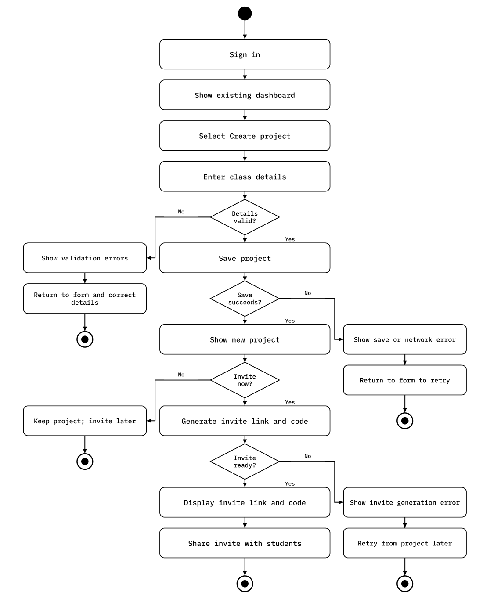
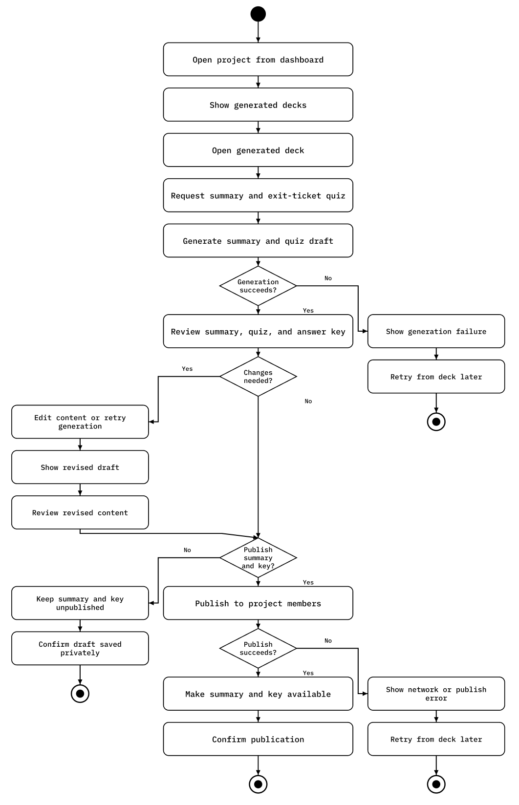
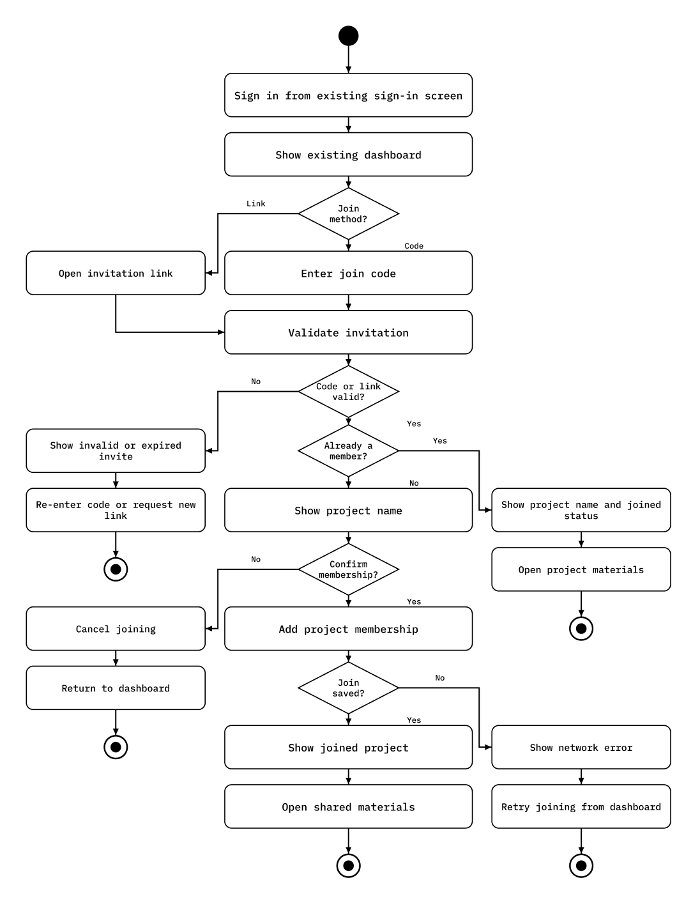
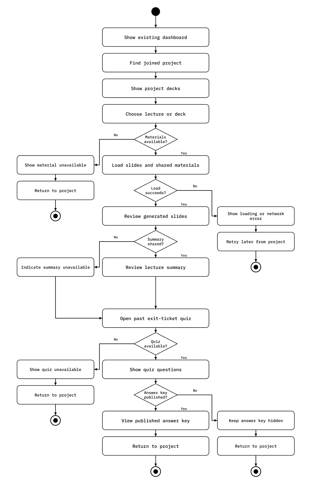

# Specification Phase Exercise

A little exercise to get started with the specification phase of the software development lifecycle. In this exercise, your team specifies a set of improvements and new features for [The Slide Machine](https://theslidemachine.com) — see the [instructions](instructions.md) for detail, and the [background](background.md) for an introduction to the software product you are tasked with extending.

## Team members

Seth DeRusha https://github.com/sethderusha
Jade Leong https://github.com/Jade-Leong
Alissa Wu https://github.com/alissawu
Pope Cruz https://github.com/pope-cruz
Khidir Ahmed https://github.com/khidirahmed

## Review of the Current Application

### Strength
- Can seed old notes to allow instructors to pick up the app quickly and keep old information about a topic.
- Privacy policy, Terms & Conditions, and feedback page are clear and visible
- Slides can be organized in projects, which is something that Google Slides/Docs lacks since there are no folders.
- Can translate slides into different languages.

### Weakness
- Sidebar on landing page on left-hand side which is not optimal.
- Text to speech on replay is very robotic.
- Minimum password length unclear.
- No dark mode.

### Gap
- No on-boarding flow in the app. After sign-up user is just placed in the main page with little direction.
- No differentiation between student and instructor workflow, students can only view slides on a instructor level, not a class/project level.
- No way to review exit ticket quizzes as someone looking back at slides.
- No comment/feedback system on slides level, only upvote and downvote.

## Prior Art & Originality

We checked the SPEC.md and ROADMAP.md. We noticed that the weakness of the text to speech has been addressed, but we believe it still needs improvement. We also noticed that there was planned onboarding documents for faculty, but there should be an onboarding flow when signing in the application. We noticed the problem with the exit-ticket system due to FERPA, but there should be a way to view the questions and answers when reviewing the slides for studying. Although our two suggestions address similar issues, we believe we have a more comprehensive idea.

## Stakeholders

**Students:** 
- JH: JH is a third-year undergraduate student in the Interactive Media Arts program in Tisch. JH is also active in student clubs, and also regularly leads general meetings which provides an interesting use case. The first main issue was the lack of clarity on the landing page and the purpose of what the dashboard was, the voting system was unclear on her end, and as to why there was a discover section for presentations. I presented Prof. Bloomberg's profile, and it was noted that she would like easier use of navigation of presentations, one such suggestion was tabs or dropdown menu in the profile. Going through the presentations she wished for a carousel to skip ahead in the slides when reviewing as clicking through slides with 100+ slides can be cumbersome. I also had her test the slide generation features, and the model was not able to properly understand her voice, and the model also did not work well in louder environments (Floor 5 in Bobst). The settings felt somewhat counterintuitive with the two movable tool bars.
- JL: JL is a undergraduate student in computer science who regularly does research and builds slide decks for class projects, using Google Slides without major complaints. He also reviews professors' slides to study but finds many too sparse to learn from, so he wants easy importing and sharing, generated slides, and a simple way to revisit past classes' slides. His biggest frustrations are formatting, rearranging and cropping, poor image quality, and latency. When he tested slide generation with his paper, his long title was cropped on the cover slide, the second slide was a wall of text that needed an image right away, and the image he requested came back as a generic neural network graphic. He found the latency high and text popping up during generation distracting, and having to explicitly ask for an image felt awkward. I showed him a professor's profile, and he found it useful and would want Command+F within a page, but noted there was no easy way to navigate to a project and no search or dates. He also flagged that other people's project names looked editable, delete modals appeared on others' slides, the share/settings button just opened the slides, and account deletion felt too easy.
- SK: SK is a third-year undergraduate student in NYU Steinhart studying Industrial Engineering, and is a Go-To-Market intern at an agent router company and regularly creates product demo presentations. Her main goals are to easily make product demo slides without starting from scratch, to be able to speak or paste a script and receive an editable template to revise, and to skip the manual formatting step so she can focus on content rather than design. Her primary frustrations that she hopes The Slide Machine can solve are that it's annoying to take a script and manually turn it into bullet points, then format those into a presentation she can edit - the process has too many steps. When testing The Slide Machine, she found that when she read an entire script and pasted the script notes into the app, it only created one slide rather than breaking it into multiple slides, missing a lot of content. She also noted the lack of personalization options for slide themes.
- SM: SM's initial impression of the app was positive, particularly the minimalistic design, which made it easy to navigate. SM saw it as a useful tool for students, serving as both an organized place for notes and a learning resource. The main issue was that the app isn't very intuitive on first use, and SM felt an onboarding stage would make things much easier since users need to be shown how the tool works. Along the same lines, SM suggested a tutorial specifically for the voice feature used to create slides. SM also wished lectures could be grouped by category, so that content shared by other people could be found in one place by topic. Lastly, SM wanted the ability to share lectures and specific notes with friends.

**Instructors:**
- FH: FH is a teaching assistant for CS 202 Operating Systems @ NYU CAS. When he was first onboarded he was confused on the actual purpose of The Slide Machine until he started making lecture slides. With the seed material he was unsure what the AI would do with the seed material, and the context of the type of audience he is presenting to (e.g. seed material can all be known to the target audience and is a waste to regurgitate in the slides). He personally appreciated the ability to use LaTeX, but when he prompted for a diagram a seed image came out. He also would wish him prompting the creation of slides, vs. the transcript would be different tracks since "write a math equation" would not be helpful for students reviewing. Lastly, he suggested that there would be a native inbuilt diagram maker instead of using one from online.
- AC: AC is a Rise Of Internet Media professor @ NYU Steinhardt. After using it for a few minutes, he said there's no way he would use this app. He thinks slide making is labor intensive but this is intensely limited. Just couldn't figure out how to make the slides more compelling. Described things and not much changed and it kept making two slides.
Few notes from AC:
1. It's always hard to be able to access although that I know and want to say or reference.  
2.  Images are vital to retaining students interest. Searching for them takes time and turning them into slides takes time.
3.  I run a device free classroom so students have to take notes by hand. I think it would be nice if lectures could have ai notetakers so that they were delivered to students aftereawrds so students could lock in and concentrate.

## Product Vision Statement

The Slide Machine creates a seamless session experience for instructors and students, guiding each user to the information and actions relevant to their role. Specialized onboarding helps instructors create a project and students join one, while a clear end-of-session flow provides organized notes from the slides and access to the exit ticket. 

## User Requirements

Instructor:
1. As an instructor, I want to know all features in the website to navigate the app.
2. As an instructor, I want to personalize my settings so that there's consistency within projects.
3. As an instructor, I want to organize my projects so that audiences can see all relevant slides in one place.
4. As an instructor, I want to control access through project membership that only invited student have access.
5. As an instructor, I want to be able to add members through an invite link or join code to a project to manage project-level permissions.
6. As an instructor, I want to be able to remove members from a project to manage a project to manage project-level permissions.
7. As an instructor, I want to be able to see how to properly use the seed info and how to call it into a presentation.
8. As an instructor, I want to know how to properly prompt the slide maker so that I can take full advantage of the app.
9. As an instructor, I want to be able to send project members a revised AI summary of the generated slides.
10. As an instructor, I want to automate sharing of past quizzes and answer keys so that students can review materials for exams.

Goals:
1. The current landing page does not clearly explain what to do.
2. Long presentations are cumbersome to navigate.
3. Slide generation can perform poorly with noise/long input.
4. There is no clear class/project-level organization for lecture materials.

Student:
1. As a student, I want to access all of my class's slides to review/reinforce information from my lectures.
2. As a student, I want to review quizzes so I can understand gaps in my knowledge.
3. As a student, I want to know where all features are so I can quickly start reviewing.
4. As a student, I want to make slideshows from my voice to engage with my content.
5. As a student, I want to have an interface focused on review to streamline my usage of the app.
6. As a student, I want to have practice questions to study for exams based on what covered.
7. As a student, I want to have reliable summaries of lectures to ensure I didn't miss important information.
8. As a student, I want to be able to access my projects from the home page so I can navigate quickly.
9. As a student, I want to quiz questions and correct answers to be saved in the app so I can review them when studying.
10. As a student, I want to join my class's project so I can access the slides and materials shared by my instructor.

Goals:
1. Easily find and review class lectures.
2. Navigate long presentations efficiently.
3. Access quizzes and answers after lectures.
4. Create/edit presentations without extensive manual formatting.

## Activity Diagrams

### 1. Create Project

An instructor should be able to make a project, and easily send out the projects to the students in their class.

### 2. Review and Publish Materials

An instructor should be able to review a generated summary, quiz, and answer key. They should be able to edit the content, and send it out to their students.

### 3. Join Instructor Project

A student should be able to easily join an instructor project from a join code or invitation link, and access the shared materials.

### 4. Review Lecture and Quiz

A student should be able to review the existing lectures in their class, look at the lecture summary, and open the past exit-ticket questions and answers.

## Wireframes

https://www.figma.com/design/QT7DyXK1LxgwSR11gh1XCS/sakjp-wireframe-project-1?node-id=0-1&t=xUagaqxojrW13Ulz-1

## Clickable Prototype

See instructions. Delete this line and place a publicly-accessible link to your clickable prototype here.

## Stakeholder Demo

https://theslidemachine.com/d/untitled-c7a88bb7

## Exit Ticket

https://docs.google.com/forms/d/e/1FAIpQLSdOxW7Kq8FxCUkV8mQk_72PZSOBEAaJ56lJ4kqJryC08X1S0Q/viewform

## Notes + Planning
## Core Feature Changes (Ideation for onboarding)
- onboarding
- new membership concept
- offboarding

1. Sign in
2. Are you a student or instructor? 
    * Instructor:
    * Guided walk through of the site with all features => 
    * slideshow tutorial => 
    * bring you to the slideshow creation screen for the tutoprial ^
    * Make your first slide show : "Press the mic and say 'Welcome to the slide machine'"
        * change anything you want on this slide afterwards. => next
        * describe a picture "say picture of kittens" + tutorial will show pic of kittens
    * click 'create exit quiz'
    * then it could be a guided walkthorugh of setting up your default settings = privacy, default slide template (show the templates that are available) => show the rest of the features, with teh spotlight cursor thing
    * create a project (['what class are you teaching, prompt prof to put in class somehow'])
    * you can also add seed info ("pre-fill seed info")
        * using our Filled seed info. It generates a slide so that the professor can see what it would look like. 
    * generate an invite link, and code to send to students so they can be members of this project 
        * you can find your members/students here (have remove button next to this)

    * - see questions on the exit interview to review + answer key (persistence and display)
    * start creating. 
- member of a class (technically project)

* Student
    * First sign in: Do you have an invite code? 
        * enter code here 
        * is this your class? display 'project' name 
    * Clicked prof's invite link:  
        * join class 'classname' - confirmation screen

After these two different flows, 
* welcome to 'prof's class'= this is where all content generated by prof lives
* click the slideshow that the professor made 
* here is where you can listen to the professors transcript/slides
* here is where the exit quiz and answer key is
* if you have another class, here's where u put the join code
* if you want to create your own slides, then click + on the top (create slide)
    * if a student decides to The slides go into the same flow for the slideshow as the professor does
* you're all set 

Offboarding section is showing where the quizzes are stored!
